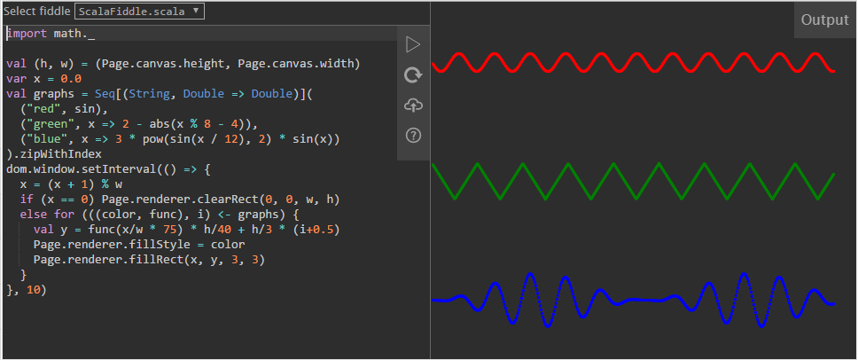
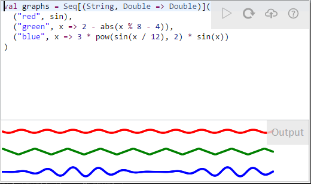

# Using Scala Fiddle

Scala Fiddle provides an embeddable web component where the user can edit and run Scala code. The source code is
compiled to JavaScript on the server and then run in the browser.

## Embedding with `iframe`

To embed a fiddle in your web page, put it in an `iframe` tag:

```html
<iframe src="<fiddlehost>/embed?<parameters>" height="300" frameborder="0" style="width: 100%; overflow: hidden;"></iframe>
```

You can use normal `iframe` attributes like `style`, `frameborder` and `height` to control the size of the fiddle
component. Scala Fiddle will automatically fill the entire space allocated for the `iframe` and creates a thin border
around itself.

### Parameters

Scala Fiddle can be customized by providing it with parameters in the URL. These parameters are discussed in more detail
later in this document, but here is a short overview.

|Parameter|Description|
|----|----|
|sfid|Load source file(s) from scalafiddle.io|
|gist|Load source file(s) from a Github gist.|
|source|Source code for the fiddle.|
|files|List of files to load from a gist.|
|env|Select an environment for the fiddle.|
|theme|Visual theme.|
|style|Custom CSS styling.|
|layout|Choose between horizontal and vertical layout.|
|responsiveWidth|Minimum width for horizontal layout.|

## Providing content

An empty fiddle may be a nice playground, but usually you'll want to provide some content in it. There are two ways
to provide source code to the fiddle:

1. From ScalaFiddle
2. From a Github gist
3. As inline parameter

To access a fiddle stored on the ScalaFiddle server use its identifier with version number:

```
/embed?sfid=0aRs0/1
```

You can also provide multiple identifiers separated with commas to load multiple files.

If you have the source code in a gist, simply provide the gist identifier.

```
/embed?gist=3dfc003dedd4da5d821d
```

If the gist contains multiple files, this will select the first one by default. To select another file (or multiple 
files separated by commas), add a `files` parameter.

```
/embed?gist=3dfc003dedd4da5d821d&files=SierpinskiTriangle.scala
```

If you provide multiple files, Scala Fiddle will provide a dropdown above the editor to choose the file for 
editing/execution.

In case you don't want to use a gist, you can provide the source code directly with the `source` parameter.

```
/embed?source=println("Hello%20World!")
```

Note that the source code must be URL encoded.

It is also possible to provide multiple source files using the `source` parameter by using special separator commands
within the source file itself.

```scala
// $SubFiddle Main.scala
import fiddle.Fiddle.println  
object ScalaFiddle extends scala.js.JSApp {
  println("Hello World!")
}
// $SubFiddle Test.scala
import fiddle.Fiddle.println  
object ScalaFiddle extends scala.js.JSApp {
  val x = 42
  val y = 88
  println(x*y)
}
```

This will provide two files, `Main.scala` and `Test.scala` with respective content. The separators are not visible to
the end user.

## Templates

The code written in the fiddle is run inside a _template_. This template provides things like common imports and a
wrapper around the code so that it can be directly executed. The templates provides pre and post code snippet around the actual fiddle code. 

All fiddles must have an `object ScalaFiddle` to work. Usually this is provided by the template, but in some cases you may want to leave that to the user.

To mark the beginning and ending of user editable content, use `// $FiddleStart` and `// $FiddleEnd` markers.

For example a fiddle drawing different oscilloscope graphs where the user only needs to provide the individual
functions:

```scala
import fiddle.Fiddle, Fiddle.println
import scalajs.js

object ScalaFiddle {
  import math._
  val (h, w) = (Fiddle.canvas.height, Fiddle.canvas.width)
  var x = 0.0
  // $FiddleStart
  val graphs = Seq[(String, Double => Double)](
    ("red", sin),
    ("green", x => 2 - abs(x % 8 - 4)),
    ("blue", x => 3 * pow(sin(x / 12), 2) * sin(x))
  ).zipWithIndex
  // $FiddleEnd
  val count = graphs.size
  Fiddle.setInterval(10){
    x = (x + 1) % w
    if (x == 0) Fiddle.draw.clearRect(0, 0, w, h)
    else for (((color, func), i) <- graphs) {
      val y = func(x/w * 75) * h/40 + h/count * (i+0.5)
      Fiddle.draw.fillStyle = color
      Fiddle.draw.fillRect(x, y, 3, 3)
    }
  }
}
```

What the user sees:


## Visual customizing 

Scala Fiddle supports _light_ (default) and _dark_ themes. You can choose between them using the `theme` parameter. 

```
/embed?gist=3dfc003dedd4da5d821d&theme=light
```


```
/embed?gist=3dfc003dedd4da5d821d&theme=dark
```



To make the fiddle integrate even more nicely within your own web page, you can provide additional styling with the
`style` parameter. Contents of this parameter should be CSS source code that will be applied to both editor and output
`div`s.

For example to change the font you can use:

```
/embed?gist=3dfc003dedd4da5d821d&style=font-family:"Lucida%20Console",monospace;font-size:18px;
```

### Layouts

You may also customize the layout of the fiddle. By default the layout is horizontal with 50:50 split, which
automatically switches to vertical 50:50 layout on small screens of mobile devices. To override the default layout,
use the `layout` parameter with either `hXX` or `vXX` values, where `XX` denotes the percentage allocated to the code
editor. For example `layout=v70` creates a vertical layout with a 70:30 split between code and output. Even with a 
custom horizontal layout, it will switch to a vertical layout on small screens (using the provided split, though).

To control when the responsive layout switches to a vertical orientation, use `responsiveWidth`. This defines (in
pixels) the minimum width for using a horizontal layout. By default this value is 640 pixels.

Layout with a horizontal 66/34% split:


Layout with a vertical 66/34% split, which also reflects what the previous layout looks like on a narrow mobile screen.


